# Project Dataflow

This diagram captures how datasets, training loops, evaluations, and operator tooling move artifacts through the current LLM → SLM replacement effort (Fledgling baseline, Unsloth “paper” track, comparison framework, and Ops console).

## End-to-End Flow

```mermaid
flowchart LR
    subgraph capture["Data Ingestion & Capture"]
        base["Base datasets\n- slm_swap/02_dataset (xLAM, CEP JSON)\n- paper_approach/datasets (Hermes)\n- datasets/*.jsonl (biz_entity, XLAM)"]
        traces["Teacher & workflow traces\n- Langfuse spans\n- Workflow tracer logs"]
    end

    subgraph prep["Prep & Context Engineering"]
        builder["Dataset builder + test split scripts\nprepare_hermes_dataset.py\ncomparison_framework/test_*.py"]
        cep["Auto Context Engineering & CEP prompts\nslm_swap/auto_context_engineering.py\nHYBRID_APPROACH_PLAN.md"]
    end

    base --> builder
    traces --> builder
    traces --> cep
    builder --> splits["Train/Val/Test JSONLs per track\n(structured + toolcall)"]
    builder --> suites["Specialized eval suites\n(single-turn, multi-turn, domain-diverse)"]

    subgraph pipelines["Training & Evaluation Pipelines"]
        direction LR
        subgraph fledgling["Fledgling / slm_swap"]
            baseline["Baseline + CEP runners\nrun_phase1_experiment.sh\neval.py, run_cep_evaluation.sh"]
            slmArtifacts["Outputs: 04_ft adapters + 05_eval metrics\nLangfuse run traces"]
        end
        subgraph paper["Paper / Unsloth approach"]
            unsloth["train_function_call.py (Phi-4 & Llama)\nDocker unsloth-paper/*"]
            paperArtifacts["Outputs: paper_approach/adapters + eval logs"]
        end
    end

    splits --> baseline
    splits --> unsloth
    suites --> baseline
    suites --> unsloth
    cep --> baseline
    cep --> unsloth
    baseline --> slmArtifacts
    unsloth --> paperArtifacts

    subgraph compare["Comparison & Decision Layer"]
        reports["comparison_framework/reports + RUN_EXPERIMENTS.md\nAggregated metrics, CSVs"]
        gates["Decision gates (AGENT.md, NEXT_STEPS.md)\nFine-tune? Which adapter?"]
    end

    slmArtifacts --> reports
    paperArtifacts --> reports
    reports --> gates

    subgraph ops["Ops, Distribution & Runtime"]
        selector["Model catalog & selector\nbackend/api/slm/*\nslm_swap/model_selection.json"]
        hf["HF upload helper\nslm_swap/hf_upload.py"]
        runtime["Mastra / orchestrator runtime\nMulti-call agent + CEP prompts"]
    end

    gates --> selector
    slmArtifacts --> hf
    paperArtifacts --> hf
    hf --> selector
    selector --> runtime
    cep --> runtime

    subgraph observability["Observability"]
        langfuse["Langfuse traces (train/eval)"]
    end

    baseline --> langfuse
    unsloth --> langfuse
    gates --> langfuse
    runtime --> langfuse
```

## How to Read This
- **Capture → Prep:** Base datasets (Hermes, xLAM, biz entity) plus Langfuse traces feed the dataset builder scripts, which emit per-track JSONL splits and purpose-built eval suites.
- **Pipelines:** The same splits power both the `slm_swap` CEP-enabled baseline and the Unsloth “paper” pipeline; each produces adapters, metrics, and Langfuse telemetry.
- **Comparison Layer:** `comparison_framework` consumes both sets of artifacts, generates consolidated reports, and drives the decision gates documented in `AGENT.md`, `NEXT_STEPS.md`, and `IMPLEMENTATION_SUMMARY.md`.
- **Ops & Runtime:** Once a model passes gates, operators use the backend/frontend selector (persisted in `slm_swap/model_selection.json`) to promote it, optionally pushing artifacts via the HF upload helper. The chosen adapter and CEP prompts then power the Mastra/multi-call runtime.
- **Feedback Loops:** Langfuse captures every run, feeding new traces back into dataset building and CEP prompt refinement so the loop can continue without manual labeling.
